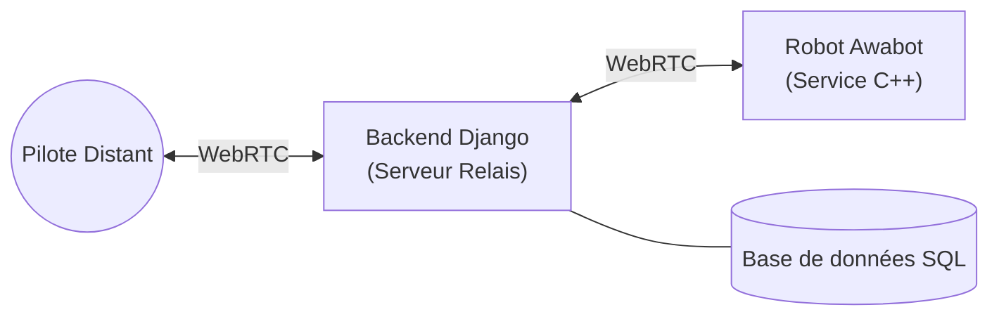
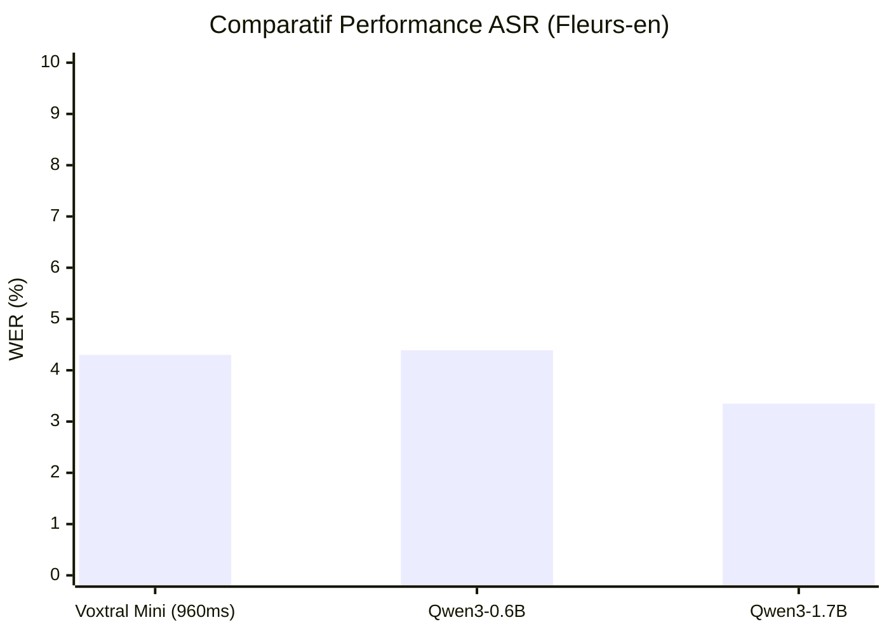

  

# Cahier des charges — Awabot

## 1. Contexte et objectifs

**Contexte :**
Awabot est un acteur majeur de la robotique de service, spécialisé dans la **téléprésence**. L'entreprise permet à des utilisateurs d'être virtuellement présents à un endroit distinct via des robots pilotables à distance.

**Objectifs du projet :**
1.  **Simplifier l'onboarding pour les lieux culturels :** Refondre l'expérience de mise en place et de configuration pour le personnel du centre culturel. L'objectif est de réduire la friction opérationnelle : le robot doit être prêt à l'emploi ("plug-and-play") avec une intervention minimale et aucune compétence technique requise sur site.
2.  **Conquérir le marché du Tourisme :** Adapter la solution pour permettre des **visites à distance** de lieux culturels ou touristiques. L'utilisateur doit pouvoir prendre le contrôle d'un robot pour visiter un musée ou un monument depuis chez lui, offrant une expérience immersive et interactive.

## 2. Description du concept et de l’environnement digital

**La Mission Sociale : L'Inclusion par la Technologie**
Le projet repose sur une forte dimension sociale et inclusive. L'objectif est de permettre aux personnes "empêchées" (hospitalisées, à mobilité réduite, en EHPAD, ou socialement isolées) de vivre de nouvelles expériences, de se cultiver et de "sortir" de leur quotidien sans contrainte physique.

**Le Concept : Le Tourisme en Téléprésence**
Nous proposons une plateforme de **tourisme immersif à distance**. L'utilisateur prend le contrôle, depuis chez lui, d'un robot de téléprésence Awabot situé dans un lieu culturel ou touristique partenaire.
-   **Immersion** : Pilotage intuitif du robot pour se déplacer librement dans le musée ou le lieu (visite non linéaire).
-   **Interaction** : Échange en temps réel avec les guides et les autres visiteurs grâce à la vidéo et l'audio bidirectionnels (le visiteur distant est "présent").
-   **Autonomie** : L'utilisateur est acteur de sa visite, il choisit son parcours et ses points d'intérêt.

**L'Environnement Digital**
L'écosystème repose sur une interface web simplifiée (Web App), conçue pour être accessible au plus grand nombre (design inclusif) :
1.  **Portail de Réservation :** Catalogue des lieux visitables (musées, monuments) et réservation de créneaux horaires.
2.  **Interface de Pilotage (Cockpit) :**
    -   Retours vidéo HD faible latence.
    -   Contrôles de déplacement ergonomiques (clavier, souris, tactile).
    -   Fonctionnalités d'aide à la conduite ("Click-to-go") pour simplifier la navigation.
    -   Zoom / Orientation caméra pour observer les œuvres.
3.  **Onboarding Simplifié (Côté Lieu) :** Procédure de démarrage et de connexion du robot ultra-simplifiée pour le personnel du musée. Scan d'un QR code, connexion automatique au réseau, et auto-test des capteurs. Le personnel ne doit pas avoir à "configurer" le robot, juste à l'allumer.

**Les Acteurs du Projet**
La solution s'adresse à deux types d'utilisateurs distincts mais interdépendants :
1.  **L'Acteur Culturel (Le Lieu) :** C'est le client B2B (musée, château, site touristique). Il met à disposition les robots pour élargir son audience, renforcer son accessibilité et proposer une offre innovante. Il a besoin d'une gestion simple de sa flotte et de ses créneaux de visite.
2.  **Le Visiteur Distant (Le Pilote) :** C'est l'utilisateur final. Il réserve et pilote le robot. Il cherche une expérience fluide, immersive et simple, sans barrière technique.

## 3. Spécifications techniques

### 3.0 Contraintes techniques et solution

**Contraintes & Existant :**
1.  **Héritage Technique (Legacy) :** Les interfaces actuelles (pilotage et gestion) sont développées en **C++ avec Qt**. Cette stack est performante mais rigide, difficile à maintenir et nécessite une installation lourde sur les postes clients.
2.  **Continuité de service :** Le protocole de communication du robot (WebRTC via serveur relais) est robuste et ne doit **pas être modifié**. Cela inclut le flux vidéo/audio ainsi que le canal de données (**WebRTC Data Channels**) utilisé pour le pilotage temps réel, qui resteront strictement identiques.
3.  **Latence critique :** Le pilotage nécessite toujours un temps réel strict (< 200ms).
4.  **Facilité de déploiement (Stratégie Web) :** Le passage à une solution Full Web n'est pas une contrainte technique absolue (le système actuel fonctionne), mais représente un **levier majeur d'amélioration**. Cela élimine les barrières à l'entrée (installation de logiciels) et simplifie drastiquement le déploiement dans les lieux culturels.

**Solution proposée :**
Une stratégie de **modernisation ciblée**. Nous conservons la brique "Robot/Relay" existante mais nous remplaçons intégralement la couche présentation (Interfaces Pilote & Centre Culturel) par une technologie web moderne : **Nuxt.js**.

### 3.1 Architecture technique

*   **Robot (Inchangé) :** Service embarqué existant. Continue de communiquer en WebRTC (Audio/Vidéo + Data Channels) avec l'infrastructure actuelle.
*   **Infrastructure Relais (Inchangée) :** Serveurs WebRTC/TURN/STUN existants.
*   **Nouvelle Plateforme Web (Nuxt.js) :**
    *   **Interface Centre Culturel (Dashboard) :** Pour la gestion de flotte, le monitoring et l'onboarding simplifié.
    *   **Interface Pilote ("Cockpit") :** Application web réactive pour le contrôle du robot, remplaçant le client lourd C++/Qt.
    *   **Backend API (Django + DRF) :** Modernisation de la couche API pour servir les données aux nouvelles interfaces web, en s'appuyant sur le backend Django existant.

### 3.2 Langages / blocs / API / plugins envisagés

**Frontend & Framework Applicatif :**
*   **Framework Principal :** **Nuxt.js** (Vue 3). Choisi pour sa robustesse, sa modularité et son expérience développeur (DX) optimale. Ce choix se fait également en contraste avec **Next.js** (React), qui, malgré sa popularité, présente un historique récurrent de **vulnérabilités de sécurité critiques** (CVE) affectant les mécanismes de middleware, d'authentification et de Server Actions. Ces failles, souvent classées sévères, imposent des mises à jour d'urgence fréquentes et un risque opérationnel non négligeable pour une plateforme en production. Nuxt.js offre un écosystème plus stable et une surface d'attaque réduite.
*   **Rendering :** SPA (Single Page Application) ou SSR (Server Side Rendering) selon les besoins de SEO pour la partie publique.
*   **State Management :** Pinia.
*   **Design System :** TailwindCSS (pour une intégration rapide et sur-mesure) + Headless UI.
*   **Communication Robot :** Intégration des librairies WebRTC existantes adaptées pour le web.

**Backend (API & Gestion) :**
*   **Framework :** **Django** (Python). Conservation du backend existant pour la logique métier et la base de données.
*   **API :** Ajout de **Django Rest Framework (DRF)** pour exposer une API REST moderne consommable par le frontend Nuxt.js.
*   **Signaling/Temps Réel :** Serveur de signalisation existant (WebRTC via serveur relais) conservé en parallèle.

### 3.3 Transcription (ASR)

La transcription temps réel (Speech-to-Text) constitue la **première étape critique** de notre moteur d'interaction IA. Elle transforme le flux audio capturé par le robot en texte structuré, moteur indispensable à la brique suivante : la **traduction instantanée**.

Pour cette fonction, nous recommandons l'utilisation du modèle **Voxtral Mini 4B Realtime** de Mistral AI.

**Pourquoi Voxtral Mini 4B Realtime :**

*   **Open-source (Apache 2.0)** : Déployable sur nos propres serveurs, sans dépendance à un service cloud tiers. Cela garantit la souveraineté des données audio des visiteurs.
*   **Streaming natif** : Architecture à attention causale conçue pour la transcription en temps réel, avec une latence configurable à partir de 80ms.
*   **Performances multilingues** : Supporte 13 langues incluant le français et l'anglais, avec un Word Error Rate (WER) parmi les meilleurs de sa catégorie sur le benchmark FLEURS.
*   **Taille raisonnable (4B paramètres)** : Exécutable sur un seul GPU 16 Go (ex : NVIDIA T4 ou L4), compatible avec une infrastructure cloud standard.

> **Lien modèle :** [mistralai/Voxtral-Mini-4B-Realtime-2602 sur HuggingFace](https://huggingface.co/mistralai/Voxtral-Mini-4B-Realtime-2602)

**Benchmark — Word Error Rate sur FLEURS :**

- Voxtral Mini 4B Realtime : 

**Stratégie de déploiement :**

Le modèle Voxtral Mini 4B est exécutable directement en **Python** via le framework d'inférence [vLLM](https://github.com/vllm-project/vllm), ce qui permet une intégration native dans l'écosystème applicatif existant (backend Django/Python). Nous recommandons particulièrement **vLLM** car il s'agit d'un projet **très activement maintenu** (mises à jour fréquentes, large communauté de contributeurs, support rapide des nouveaux modèles), garantissant une compatibilité durable et un accès aux dernières optimisations de performance (PagedAttention, batching continu, quantification).

Bien que Mistral AI mette à disposition une **API cloud** pour la transcription, nous recommandons de déployer et d'opérer notre propre instance du modèle pour les raisons suivantes :

*   **Indépendance opérationnelle** : Aucune dépendance vis-à-vis d'un service tiers. En cas de maintenance, de changement tarifaire ou de discontinuation du service Mistral, notre infrastructure de transcription reste pleinement fonctionnelle.
*   **Garantie de disponibilité (SLA)** : Un hébergement maîtrisé permet de garantir un uptime adapté aux exigences de la plateforme, sans être soumis aux éventuels downtimes d'un fournisseur externe.
*   **Souveraineté des données** : Les flux audio des visiteurs ne transitent jamais par un serveur tiers, conformément aux exigences RGPD et de confidentialité du projet.
*   **Latence optimale** : Le modèle étant co-hébergé avec le reste de l'infrastructure, la latence réseau est minimisée par rapport à un appel API distant.

### 3.4 Benchmarks ASR

En complément de Voxtral, nous avons évalué les performances d'autres modèles de pointe, notamment la série **Qwen3-ASR**. Ces modèles offrent une alternative solide avec une efficacité remarquable.

**Tableau comparatif des performances (WER - Word Error Rate) :**

| Dataset | Metric | Qwen3-0.6B | Qwen3-1.7B |
| :--- | :--- | :---: | :---: |
| **English (en)** | | | |
| GigaSpeech | WER | 8.88 | **8.45** |
| CV-en | WER | 9.92 | **7.39** |
| Fleurs-en | WER | 4.39 | **3.35** |
| **Chinese (zh)** | | | |
| AISHELL-2 | WER | 3.15 | **2.71** |
| Fleurs-zh | WER | 2.88 | **2.41** |

**Graphique comparatif — Fleurs-en (WER) :**
*(Le score le plus bas est le meilleur)*

**Comparatif Final — Voxtral vs Qwen3 (WER) :**

> [!NOTE]
> Bien que Voxtral soit extrêmement rapide pour du temps réel pur, la série **Qwen3** montre une précision (WER) supérieure sur les tests de transcription complexes dans le benchmark Fleurs en Anglais.

L'utilisation de **Qwen3-ASR (1.7B)** est une option sérieuse si l'on recherche un compromis optimal entre vitesse d'inférence et précision, particulièrement sur les datasets longs ou complexes.

> **IMPORTANT : Souveraineté et modèles Open-Weight** : Dans une stratégie d'auto-hébergement, la provenance géographique d'un modèle (ex: modèles chinois comme Qwen) ne constitue pas un risque de sécurité ou de confidentialité. Contrairement à une utilisation via API Cloud soumise à des politiques de collecte de données tierces, un modèle **Open-Weight** exécuté sur notre propre infrastructure est totalement isolé. Le flux de données est géré de bout en bout par Awabot, garantissant l'absence de fuites ou de surveillance externe.

Cependant, il est important de noter que le modèle chinois Qwen3-ASR performe particulierement avec l'anglais et le chinois, mais beaucoup moins bien avec le français ou l'espagnol par exemple. Là où le modèle Voxtral par contre permet une très bonne transcription dans les langues européennes.

Nous sommes donc confiant sur le fait qu'il faut faire un mélange de Qwen3 ASR dans les langues qu'ils gèrent le mieux, et Voxtral pour les langues européennes.

### 3.5 Traduction

Une fois la parole capturée et transcrite avec une faible latence par la brique ASR, le système entre dans sa phase de **traduction**. L'objectif est de permettre un échange fluide entre un visiteur et un guide s'exprimant dans des langues différentes.

**Avantage décisif des LLM :**
L'usage de modèles de langage (LLM) pour la traduction offre une opportunité de **correction contextuelle**. Un LLM ne se contente pas de traduire mot-à-mot ; il est capable de :
*   **Réparer les erreurs d'ASR** : Si un mot est mal transcrit phonétiquement mais que le sens reste déductible, le LLM peut reconstruire la phrase correcte avant la traduction.
*   **Ajuster le ton** : Garantir que la traduction respecte le contexte culturel du lieu visité.

**La Boucle de Transcription & Traduction :**
Le flux de données suit un cycle itératif conçu pour minimiser la latence perçue :
1.  **Capture Audio** : Le robot transmet le flux audio au serveur d'inférence.
2.  **Transcription (ASR)** : Le texte est généré en temps réel par Voxtral ou Qwen3.
3.  **Traduction (NMT)** : Le texte transcrit est envoyé à un modèle de traduction (Neural Machine Translation) pour être converti dans la langue cible.
4.  **Synthèse Vocale (TTS)** : Une fois qu'une phrase complète est détectée, le texte traduit est transformé en parole via un modèle de synthèse, permettant une communication orale fluide.

**Solutions de traduction envisagées :**
Pour maintenir la souveraineté et la performance, nous préconisons :
*   [**HY-MT (Tencent)**](https://huggingface.co/tencent/HY-MT1.5-1.8B) : Modèle de pointe offrant une qualité de traduction exceptionnelle pour le multilingue.
*   [**Gemma Translate**](https://huggingface.co/google/translategemma-4b-it) : Basé sur l'architecture Google Gemma, très performant pour les paires de langues courantes (FR/EN).
*   [**LibreTranslate**](https://fr.libretranslate.com/) : Solution open-source auto-hébergée robuste pour une indépendance totale et des coûts serveurs maîtrisés.
*   **Modèles de traduction via LLM** : Utilisation de modèles compacts (ex: **MarianMT** ou familles [**Mistral 8x7B**](https://huggingface.co/mistralai/Mixtral-8x7B-v0.1)) optimisés pour la traduction.
*   **Intégration vLLM** : Comme pour l'ASR, l'utilisation de **vLLM** est recommandée pour servir les modèles de traduction, permettant un débit élevé et une gestion efficace de la mémoire GPU.

Cette boucle garantit que l'interaction reste "vivante" et naturelle, même à travers une barrière linguistique.

### 3.6 Synthèse vocale (TTS)

La dernière étape du moteur d'interaction consiste à transformer le texte traduit en signal vocal. L'objectif est de permettre un échange naturel où les paroles de l'utilisateur sont restituées dans la langue du pays d'accueil.

**Stratégie de restitution :**
*   **Déclenchement intelligent** : La synthèse (TTS) est lancée automatiquement dès qu'une fin de phrase est détectée par le modèle de langage, garantissant une latence minimale.
*   **Modèle recommandé : [Qwen3-TTS (0.6B)](https://huggingface.co/Qwen/Qwen3-TTS-12Hz-0.6B-Base)** :
    *   **Extrême légèreté** : Avec seulement 600M de paramètres, il est extrêmement rapide et facile à mettre en production sur une architecture optimisée.
    *   **Clonage de voix** : Permet de cloner une voix spécifique pour une expérience utilisateur personnalisée.
*   **Exclusion de [Hibiki (Kyutai)](https://kyutai.org/blog/2025-02-10-hibiki)** : Bien que prometteur, ce modèle (sorti en février 2026) est jugé trop peu mature. Son architecture est actuellement limitée au français et à l'anglais, ce qui ne répond pas aux ambitions multilingues du projet.

## 4. Conception UI et logique d'intégration

**Approche Design :**
L'interface doit marquer une rupture avec l'austérité des interfaces industrielles en C++. Nous visons une esthétique "Premium & Accueillante".
*   **Framework UI :** Utilisation de [**TailwindCSS**](https://tailwindcss.com/) pour une flexibilité totale et une identité visuelle propre à Awabot (pas de "look" Bootstrap ou Material générique).
*   **Composants :** Création d'une bibliothèque de composants Vue.js réutilisables (Boutons, Indicateurs de batterie, Jauges de signal).

**Détail des Interfaces :**

1.  **Le "Cockpit" (Interface Pilote) :**
    *   **Vue Immersive :** La vidéo prend 100% de l'écran.
    *   **HUD (Head-Up Display) :** Les informations (vitesse, batterie, réseau) sont affichées en surimpression semi-transparente pour ne pas gêner la vision.
    *   **Contrôles Adaptatifs :** Détection automatique des périphériques (Support Gamepad, Clavier/Souris, Tactile).

2.  **Le Dashboard (Interface Centre Culturel) :**
    *   **Vue Flotte :** État de santé de tous les robots en un coup d'œil (En ligne/Hors ligne, En charge, En visite).
    *   **Planning Simplifié :** Vue calendaire des visites à venir.
    *   **Onboarding Wizard :** Pas-à-pas illustré pour l'ajout d'un nouveau robot (Scan QR Code -> Test -> Validation).

## 5. Sécurité, durabilité et maintenance

**Sécurité :**
*   **Authentification :** Gestion des sessions via JWT (JSON Web Tokens). Liens d'invitation à usage unique pour les visiteurs (pas de compte à créer pour une visite ponctuelle).
*   **Flux :** Chiffrement de bout en bout (DTLS/SRTP) pour le WebRTC.
*   **Cloisonnement :** Le robot n'accepte de connexions que du serveur de signalisation authentifié.

**Maintenance & Durabilité (Green IT) :**
*   **Zéro Installation :** La migration vers le Web (Nuxt.js) supprime la gestion des parcs de machines clientes. Une mise à jour du serveur déploie instantanément la nouvelle version pour tout le monde.
*   **Performance :** Optimisation des assets (Lazy loading via Nuxt) pour fonctionner sur des connexions modestes ou des ordinateurs vieillissants.
*   **Maintenance Code :** Usage de TypeScript pour typer le code et faciliter la reprise par de futurs développeurs.

## 6. Déploiement et mise en production

### 6.1 Planification et calendrier projeté

*   **Phase 1 : Conception & Prototypage (Mois 1)**
    *   Ateliers UX/UI pour le Dashboard et le "Cockpit".
    *   POC (Proof of Concept) technique : Validation de la stack Nuxt.js + WebRTC Data Channels (latence, fluidité).
    *   Architecture de l'API DRF.
*   **Phase 2 : Développement du MVP (Mois 2-3)**
    *   Mise en place de l'API Django Rest Framework (exposition des modèles existants).
    *   Développement du **Dashboard Centre Culturel** (Gestion flotte, Planning).
    *   Développement du **"Cockpit"** Web (Intégration flux vidéo & commandes temps réel).
*   **Phase 3 : Intégration & Migration (Mois 4)**
    *   Connexion du Frontend Nuxt.js au vrai backend de prod (via API DRF).
    *   Tests d'intégration avec les robots physiques en environnement contrôlé.
*   **Phase 4 : Phase Pilote (Mois 5)**
    *   Déploiement sur un site culturel pilote ("Friendly User").
    *   Recettage en conditions réelles (Wi-Fi public, utilisateurs novices).
    *   Ajustements UX/UI selon retours terrain.
*   **Phase 5 : Généralisation & Mise en Production (Mois 6)**
    *   Ouverture de la plateforme à l'ensemble des centres culturels.
    *   Arrêt progressif du support de l'ancien client lourd C++/Qt.
    *   Formation des équipes support.

### 6.2 Coordination et responsabilités

Le succès du projet repose sur une validation continue entre les équipes de développement et la direction d'Awabot :
*   **Validation Client (Awabot)** : Chaque phase définie dans le calendrier (Concept, MVP, Pilote, etc.) doit faire l'objet d'une revue et d'une validation formelle par Awabot. Ces "gates" garantissent que les choix techniques et ergonomiques répondent parfaitement aux besoins opérationnels du terrain.
*   **Pilotage du Projet** : Une équipe de lead technique assure le suivi quotidien, tandis qu'Awabot conserve la responsabilité de la validation finale avant chaque mise en production.
## 7. Collaboration client

Le suivi du projet est rythmé par des **réunions hebdomadaires** (sprints reviews) permettant de passer en revue les avancées de la semaine, de valider les fonctionnalités développées et de réajuster les priorités selon les retours d'Awabot.

## 8. Communication et SEO

**Optimisation et Trafic :**
*   **SEO Technique** : La structure Nuxt.js permet une indexation optimale via le Server-Side Rendering (SSR). Les meta-balises et le sitemap seront gérés nativement pour maximiser la visibilité sur Google.
*   **Analytics (Umami)** : Plutôt que Google Analytics, nous privilégions [**Umami**](https://umami.is/) pour un tracking respectueux de la vie privée (sans cookies, conforme RGPD).
    *   **Intégration native** : Nuxt s'interface parfaitement avec Umami via le module officiel [`nuxt-umami`](https://nuxt.com/modules/umami).
    *   **Avantages** : Légèreté du script, interface simple et souveraineté des données (possibilité d'auto-hébergement). Le tracking permet de suivre précisément le parcours utilisateur (Landing -> Cockpit) sans compromettre la performance.

## 9. Conclusion

La refonte de l'écosystème Awabot vers une stack **Full Web (Nuxt.js / Django)** représente un tournant stratégique majeur. En migrant du client lourd C++/Qt vers une interface web moderne, nous supprimons les barrières au déploiement tout en offrant une expérience utilisateur premium, fluide et accessible à tous, notamment dans le secteur du tourisme culturel.

Le cœur de cette innovation repose sur l'intégration d'une **boucle d'intelligence artificielle souveraine**. Le couplage de la transcription temps réel (**Voxtral / Qwen3**) et d'une traduction contextuelle par LLM garantit non seulement une accessibilité mondiale, mais assure également une confidentialité totale grâce à l'auto-hébergement systématique des modèles **Open-Weight**.

**Prochaines étapes :**
1.  Finalisation du prototype technique Nuxt + WebRTC (Phase 1).
2.  Déploiement du serveur d'inférence vLLM pour les tests ASR/Traduction initiaux.
3.  Validation du design système et de l'accessibilité du "Cockpit" avec les premiers testeurs centres culturels.

Ce projet positionne Awabot comme un précurseur de la téléprésence intelligente, alliant performance technique brute et inclusion sociale facilitée par l'IA.
## 10. Annexes

*   **Projet & Expérimentations** :
    - [GitHub Awabot Innovation](https://github.com/EthanCarollo/awabot-innovation) — Code source du site web, documentations et prototypes.
    - [Démos Interactives](https://github.com/EthanCarollo/awabot-innovation/tree/main/demo) — Ensemble des démonstrateurs ASR et TTS.
*   **Transcription & Audio** :
    *   [Mistral AI](https://mistral.ai/) — Modèles ASR (Voxtral).
    *   [Qwen3-Audio](https://github.com/QwenLM/Qwen-Audio) — Modèles Qwen ASR.
    *   [Kyutai](https://kyutai.org/) — Recherche sur la voix et modèles temps réel (Moshi).
*   **Infrastructure & Inférence** :
    *   [vLLM](https://vllm.ai/) — Moteur d'inférence LLM/ASR optimisé.
    *   [Django REST Framework](https://www.django-rest-framework.org/) — Backend & API logic.
*   **Modèles de Traduction** :
    - [HY-MT (Tencent)](https://huggingface.co/tencent/HY-MT1.5-1.8B) — Modèle multilingue de haute qualité.
    - [Gemma Translate](https://huggingface.co/google/translategemma-4b-it) — Traduction optimisée par Google.
    - [LibreTranslate](https://fr.libretranslate.com/) — Solution open-source auto-hébergée.
*   **Synthèse Vocale (TTS)** :
    *   [Qwen3-TTS](https://huggingface.co/Qwen/Qwen3-TTS-12Hz-0.6B-Base) — Modèle léger (0.6B) avec clonage de voix.
    *   [Hibiki (Blog Post)](https://kyutai.org/blog/2025-02-10-hibiki) — Étude de cas sur les modèles de voix (écarté pour le projet).
*   **Frontend & Analytics** :
    *   [Nuxt.js](https://nuxt.com/) — Framework Web & SSR.
    *   [TailwindCSS](https://tailwindcss.com/) — Design system & CSS framework.
    *   [Umami](https://umami.is/) — Analytics respectueux de la vie privée.
