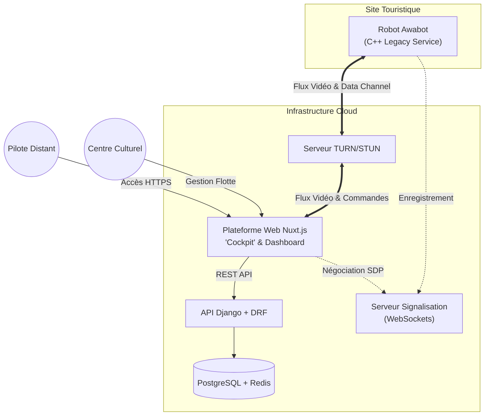

# Cahier des Charges

## 1. Contexte et objectifs

**Contexte :**
Awabot est un acteur majeur de la robotique de service, spécialisé dans la **téléprésence**. L'entreprise permet à des utilisateurs d'être virtuellement présents à un endroit distinct via des robots pilotables à distance.

**Objectifs du projet :**
1.  **Simplifier l'onboarding pour les lieux culturels :** Refondre l'expérience de mise en place et de configuration pour le personnel du centre culturel. L'objectif est de réduire la friction opérationnelle : le robot doit être prêt à l'emploi ("plug-and-play") avec une intervention minimale et aucune compétence technique requise sur site.
2.  **Conquérir le marché du Tourisme :** Adapter la solution pour permettre des **visites à distance** de lieux culturels ou touristiques. L'utilisateur doit pouvoir prendre le contrôle d'un robot pour visiter un musée ou un monument depuis chez lui, offrant une expérience immersive et interactive.

## 2. Description du concept et de l’environnement digital

**La Mission Sociale : L'Inclusion par la Technologie**
Le projet repose sur une forte dimension sociale et inclusive. L'objectif est de permettre aux personnes "empêchées" (hospitalisées, à mobilité réduite, en EHPAD, ou socialement isolées) de vivre de nouvelles expériences, de se cultiver et de "sortir" de leur quotidien sans contrainte physique.

**Le Concept : Le Tourisme en Téléprésence**
Nous proposons une plateforme de **tourisme immersif à distance**. L'utilisateur prend le contrôle, depuis chez lui, d'un robot de téléprésence Awabot situé dans un lieu culturel ou touristique partenaire.
-   **Immersion** : Pilotage intuitif du robot pour se déplacer librement dans le musée ou le lieu (visite non linéaire).
-   **Interaction** : Échange en temps réel avec les guides et les autres visiteurs grâce à la vidéo et l'audio bidirectionnels (le visiteur distant est "présent").
-   **Autonomie** : L'utilisateur est acteur de sa visite, il choisit son parcours et ses points d'intérêt.

**L'Environnement Digital**
L'écosystème repose sur une interface web simplifiée (Web App), conçue pour être accessible au plus grand nombre (design inclusif) :
1.  **Portail de Réservation :** Catalogue des lieux visitables (musées, monuments) et réservation de créneaux horaires.
2.  **Interface de Pilotage (Cockpit) :**
    -   Retours vidéo HD faible latence.
    -   Contrôles de déplacement ergonomiques (clavier, souris, tactile).
    -   Fonctionnalités d'aide à la conduite ("Click-to-go") pour simplifier la navigation.
    -   Zoom / Orientation caméra pour observer les œuvres.
3.  **Onboarding Simplifié (Côté Lieu) :** Procédure de démarrage et de connexion du robot ultra-simplifiée pour le personnel du musée. Scan d'un QR code, connexion automatique au réseau, et auto-test des capteurs. Le personnel ne doit pas avoir à "configurer" le robot, juste à l'allumer.

**Les Acteurs du Projet**
La solution s'adresse à deux types d'utilisateurs distincts mais interdépendants :
1.  **L'Acteur Culturel (Le Lieu) :** C'est le client B2B (musée, château, site touristique). Il met à disposition les robots pour élargir son audience, renforcer son accessibilité et proposer une offre innovante. Il a besoin d'une gestion simple de sa flotte et de ses créneaux de visite.
2.  **Le Visiteur Distant (Le Pilote) :** C'est l'utilisateur final. Il réserve et pilote le robot. Il cherche une expérience fluide, immersive et simple, sans barrière technique.

## 3. Spécifications techniques

### 3.0 Contraintes techniques et solution

**Contraintes & Existant :**
1.  **Héritage Technique (Legacy) :** Les interfaces actuelles (pilotage et gestion) sont développées en **C++ avec Qt**. Cette stack est performante mais rigide, difficile à maintenir et nécessite une installation lourde sur les postes clients.
2.  **Continuité de service :** Le protocole de communication du robot (WebRTC via serveur relais) est robuste et ne doit **pas être modifié**. Cela inclut le flux vidéo/audio ainsi que le canal de données (**WebRTC Data Channels**) utilisé pour le pilotage temps réel, qui resteront strictement identiques.
3.  **Latence critique :** Le pilotage nécessite toujours un temps réel strict (< 200ms).
4.  **Facilité de déploiement (Stratégie Web) :** Le passage à une solution Full Web n'est pas une contrainte technique absolue (le système actuel fonctionne), mais représente un **levier majeur d'amélioration**. Cela élimine les barrières à l'entrée (installation de logiciels) et simplifie drastiquement le déploiement dans les lieux culturels.

**Solution proposée :**
Une stratégie de **modernisation ciblée**. Nous conservons la brique "Robot/Relay" existante mais nous remplaçons intégralement la couche présentation (Interfaces Pilote & Centre Culturel) par une technologie web moderne : **Nuxt.js**.

### 3.1 Architecture technique

*   **Robot (Inchangé) :** Service embarqué existant. Continue de communiquer en WebRTC (Audio/Vidéo + Data Channels) avec l'infrastructure actuelle.
*   **Infrastructure Relais (Inchangée) :** Serveurs WebRTC/TURN/STUN existants.
*   **Nouvelle Plateforme Web (Nuxt.js) :**
    *   **Interface Centre Culturel (Dashboard) :** Pour la gestion de flotte, le monitoring et l'onboarding simplifié.
    *   **Interface Pilote ("Cockpit") :** Application web réactive pour le contrôle du robot, remplaçant le client lourd C++/Qt.
    *   **Backend API (Django + DRF) :** Modernisation de la couche API pour servir les données aux nouvelles interfaces web, en s'appuyant sur le backend Django existant.

### 3.2 Langages / blocs / API / plugins envisagés

**Frontend & Framework Applicatif :**
*   **Framework Principal :** **Nuxt.js** (Vue 3). Choisi pour sa robustesse, sa modularité et son expérience développeur (DX) optimale.
*   **Rendering :** SPA (Single Page Application) ou SSR (Server Side Rendering) selon les besoins de SEO pour la partie publique.
*   **State Management :** Pinia.
*   **Design System :** TailwindCSS (pour une intégration rapide et sur-mesure) + Headless UI.
*   **Communication Robot :** Intégration des librairies WebRTC existantes adaptées pour le web.

**Backend (API & Gestion) :**
*   **Framework :** **Django** (Python). Conservation du backend existant pour la logique métier et la base de données.
*   **API :** Ajout de **Django Rest Framework (DRF)** pour exposer une API REST moderne consommable par le frontend Nuxt.js.
*   **Signaling/Temps Réel :** Serveur de signalisation existant (WebRTC via serveur relais) conservé en parallèle.

## 4. Conception UI et logique d'intégration

**Approche Design :**
L'interface doit marquer une rupture avec l'austérité des interfaces industrielles en C++. Nous visons une esthétique "Premium & Accueillante".
*   **Framework UI :** Utilisation de **TailwindCSS** pour une flexibilité totale et une identité visuelle propre à Awabot (pas de "look" Bootstrap ou Material générique).
*   **Composants :** Création d'une bibliothèque de composants Vue.js réutilisables (Boutons, Indicateurs de batterie, Jauges de signal).

**Détail des Interfaces :**

1.  **Le "Cockpit" (Interface Pilote) :**
    *   **Vue Immersive :** La vidéo prend 100% de l'écran.
    *   **HUD (Head-Up Display) :** Les informations (vitesse, batterie, réseau) sont affichées en surimpression semi-transparente pour ne pas gêner la vision.
    *   **Contrôles Adaptatifs :** Détection automatique des périphériques (Support Gamepad, Clavier/Souris, Tactile).

2.  **Le Dashboard (Interface Centre Culturel) :**
    *   **Vue Flotte :** État de santé de tous les robots en un coup d'œil (En ligne/Hors ligne, En charge, En visite).
    *   **Planning Simplifié :** Vue calendaire des visites à venir.
    *   **Onboarding Wizard :** Pas-à-pas illustré pour l'ajout d'un nouveau robot (Scan QR Code -> Test -> Validation).

## 5. Sécurité, durabilité et maintenance

**Sécurité :**
*   **Authentification :** Gestion des sessions via JWT (JSON Web Tokens). Liens d'invitation à usage unique pour les visiteurs (pas de compte à créer pour une visite ponctuelle).
*   **Flux :** Chiffrement de bout en bout (DTLS/SRTP) pour le WebRTC.
*   **Cloisonnement :** Le robot n'accepte de connexions que du serveur de signalisation authentifié.

**Maintenance & Durabilité (Green IT) :**
*   **Zéro Installation :** La migration vers le Web (Nuxt.js) supprime la gestion des parcs de machines clientes. Une mise à jour du serveur déploie instantanément la nouvelle version pour tout le monde.
*   **Performance :** Optimisation des assets (Lazy loading via Nuxt) pour fonctionner sur des connexions modestes ou des ordinateurs vieillissants.
*   **Maintenance Code :** Usage de TypeScript pour typer le code et faciliter la reprise par de futurs développeurs.

## 6. Déploiement et mise en production

### 6.1 Planification et calendrier projeté

*   **Phase 1 : Conception & Prototypage (Mois 1)**
    *   Ateliers UX/UI pour le Dashboard et le "Cockpit".
    *   POC (Proof of Concept) technique : Validation de la stack Nuxt.js + WebRTC Data Channels (latence, fluidité).
    *   Architecture de l'API DRF.
*   **Phase 2 : Développement du MVP (Mois 2-3)**
    *   Mise en place de l'API Django Rest Framework (exposition des modèles existants).
    *   Développement du **Dashboard Centre Culturel** (Gestion flotte, Planning).
    *   Développement du **"Cockpit"** Web (Intégration flux vidéo & commandes temps réel).
*   **Phase 3 : Intégration & Migration (Mois 4)**
    *   Connexion du Frontend Nuxt.js au vrai backend de prod (via API DRF).
    *   Tests d'intégration avec les robots physiques en environnement contrôlé.
*   **Phase 4 : Phase Pilote (Mois 5)**
    *   Déploiement sur un site culturel pilote ("Friendly User").
    *   Recettage en conditions réelles (Wi-Fi public, utilisateurs novices).
    *   Ajustements UX/UI selon retours terrain.
*   **Phase 5 : Généralisation & Mise en Production (Mois 6)**
    *   Ouverture de la plateforme à l'ensemble des centres culturels.
    *   Arrêt progressif du support de l'ancien client lourd C++/Qt.
    *   Formation des équipes support.

### 6.2 Coordination et responsabilités

[Définir la hiérarchie des intervenants, les processus de validation et le lead du projet.]

## 7. Collaboration client

[Modalités de collaboration avec le client (réunions, outils de suivi, validations).]

## 8. Digital communication / logique d’acquisition et intégration web

[Stratégie d'acquisition, SEO, intégration avec les outils marketing, si applicable.]

## 9. Conclusion

[Synthèse et prochaines étapes.]
## 10. Annexes

[Documents complémentaires, maquettes, références.]
